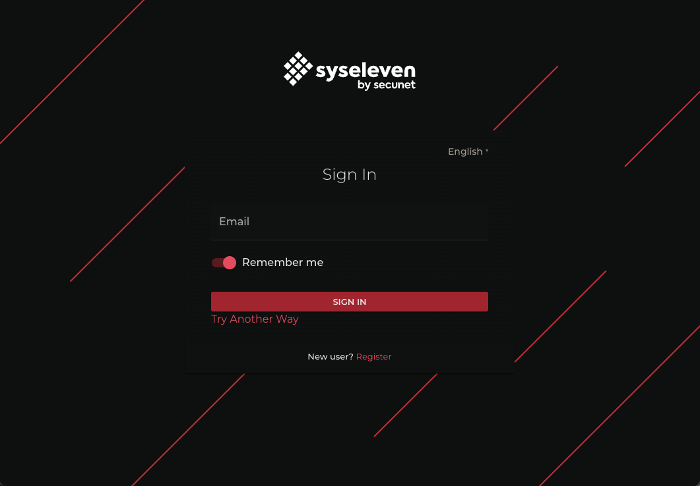
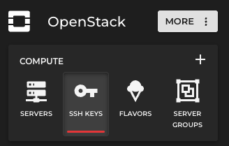
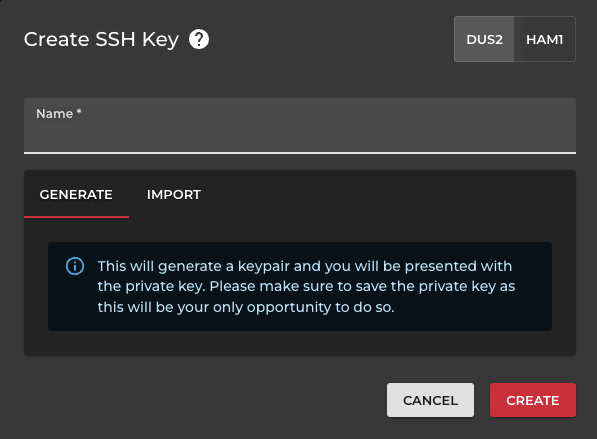
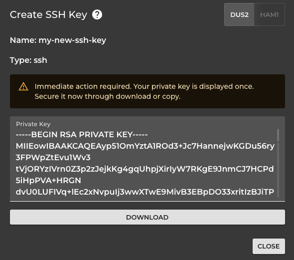
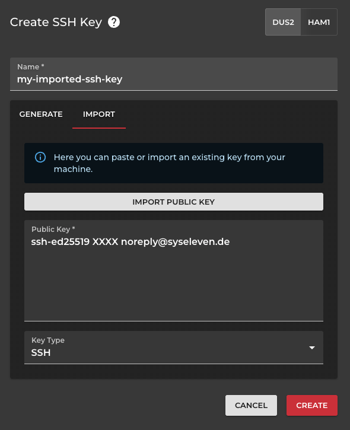

# Add an SSH keypair

## Overview

With this guide you can add an SSH keypair to your Openstack project for SSH connections
on instances.

## Goal

* Option 1: create a new SSH keypair via SysEleven Dashboard or
* Option 2: import an existing SSH public key via SysEleven Dashboard

## Preparation

* You need the login credentials for SysEleven Cloud
  * E-mail address
  * Password
* Web browser and basic knowledge using a Linux terminal and SSH

---

### Login

* Visit the URL https://dashboard.syseleven.de

* log in with your credentials
* click "Sign In"

* Make sure the right project is selected in the pojetcts drop down menu on the top left

### Option 1 - Create SSH keypair

* click "SSH Keys" under Openstack in the left side menu

* click "Create" in the top right corner
* make sure "Generate" is selected
  * also take note of the cloud region the key is created in
  * SSH keys are bound to the region
* enter a name and click "Create"

* download or copy the key for later use

* View the keypair details in the list.

---

### Option 2 - Import SSH keypair

* click "SSH Keys" under Openstack in the left side menu

* click "Create" in the top right corner
* make sure "Import" is selected
  * also take note of the cloud region the key is created in
  * SSH keys are bound to the region
* paste or import your ssh public key and hit "create"

* View the keypair details in the list.
