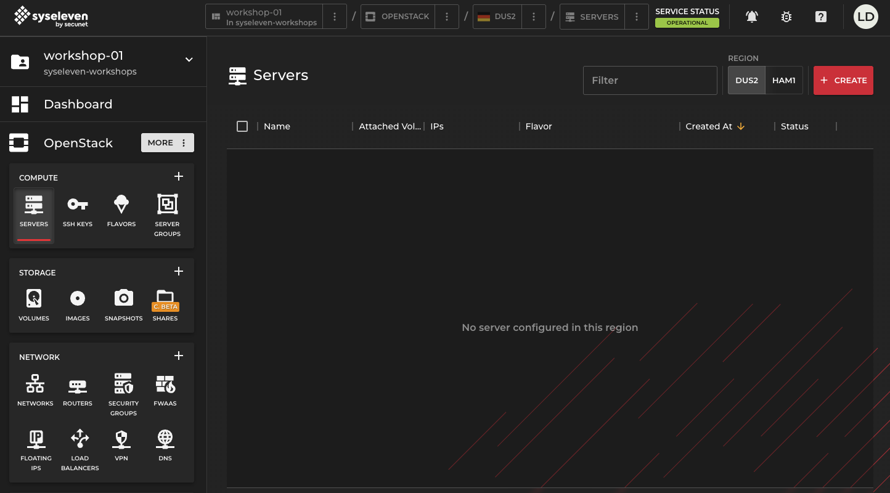
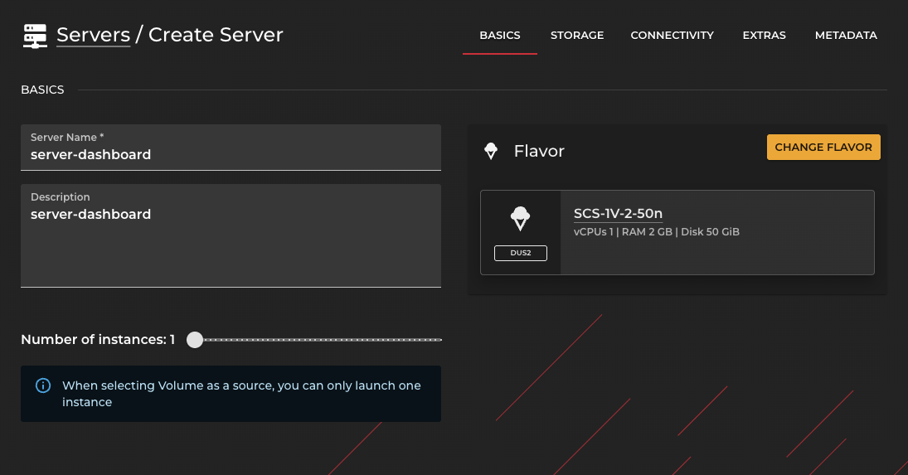
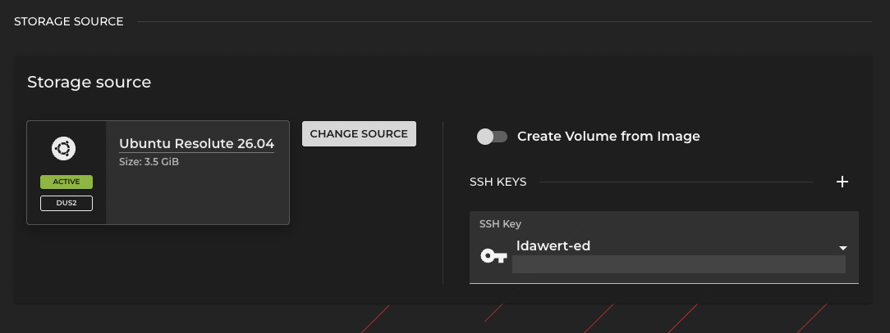
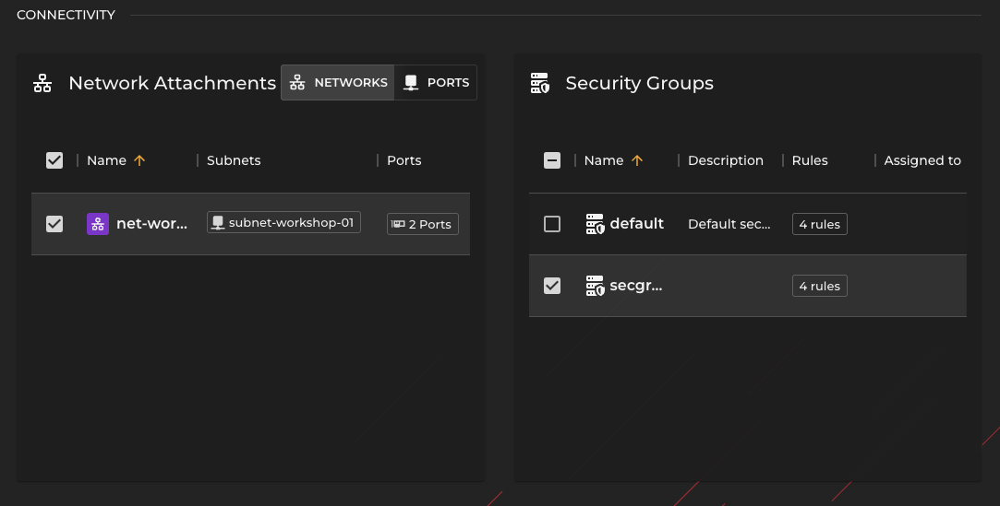

# Creating an instance via SysEleven dashboard

## Overview

With this guide you can create a single instance via Web UI.

## Goal

* Create a single instance via Horizon Web UI

## Preparation

* You need your login credentials for Openstack
  * Username
  * Password
* pre-installed jumphost infrastructure provided by SysEleven

---

## Start

* Log into https://dashboard.syseleven.de Horizon Web UI with your credentials.

---

## Create an instance

* Underneath "OpenStack - COMPUTE" click **SERVERS**
* Click the button **CREATE**
  * Make sure you stay in region **DUS2**

---

* Enter `server-dashboard` as **Server Name** and
* Optionally enter a description under **Description**
* Select flavor: `SCS-1V-2-50n` or `m2c.tiny`
* Leave the slider for `Number of Instances` at 1

---

* Scroll down to the next section: `STORAGE SOURCE`
* Select **Ubuntu** as storage source image
* From the SSH Keys drop down menu select your previously imported key

---

* Scroll down to the next section: `CONNECTIVITY`
* Select your workshop jumphost network under `Network Attachments`
* Uncheck **default** security group and check your workshop security group

---

* Click the **CREATE SERVER** button in the bottom right corner
* Watch the status of your instance in the **SERVERS** list

### What did you notice?

* the instance has no public IP address

### Other tasks

* display the instance in the Dashboard and note its IP address
* use the jumphost to ssh in to the instance

`ssh ubuntu@<Instance-IP>`
