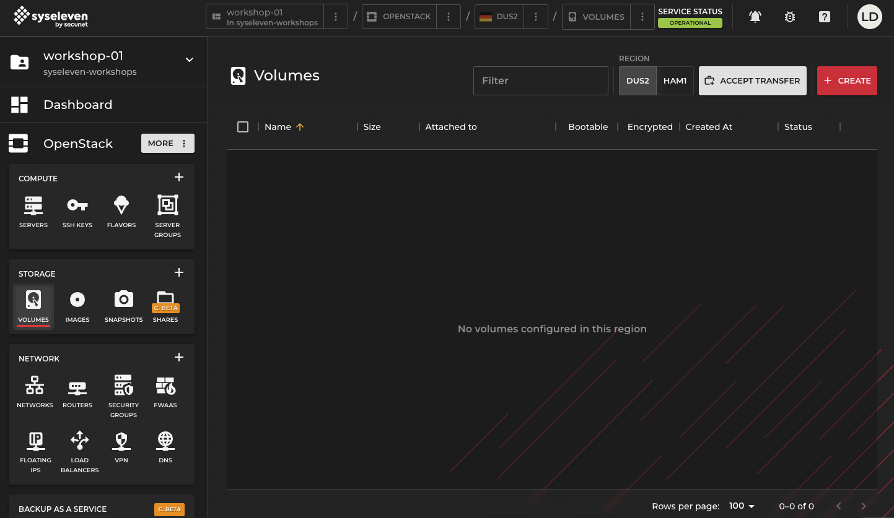
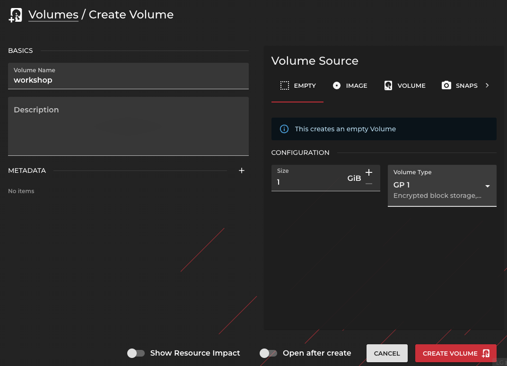
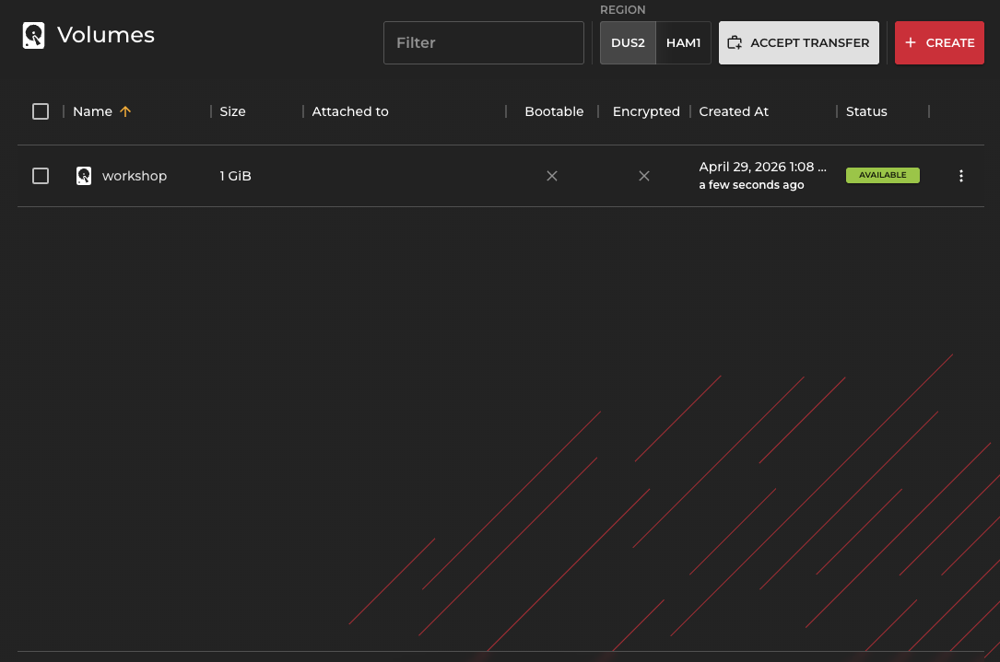
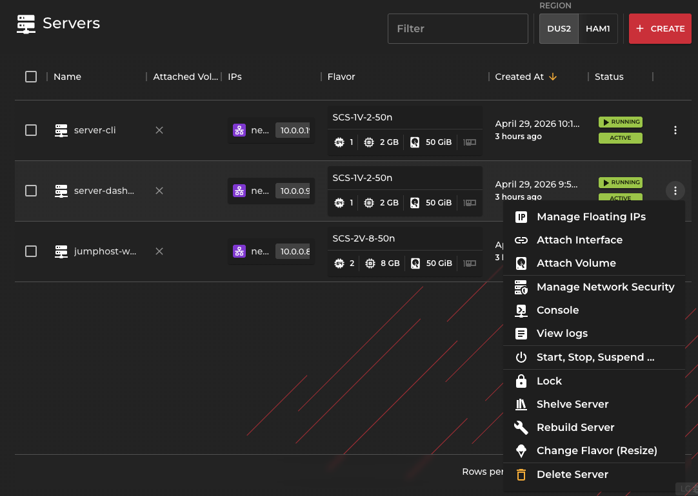
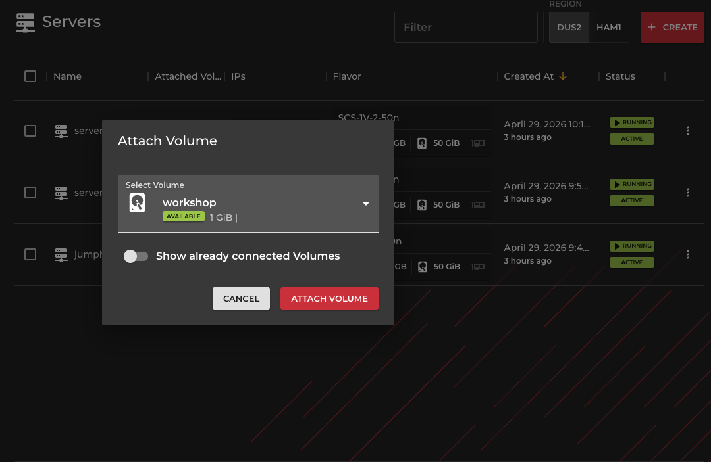
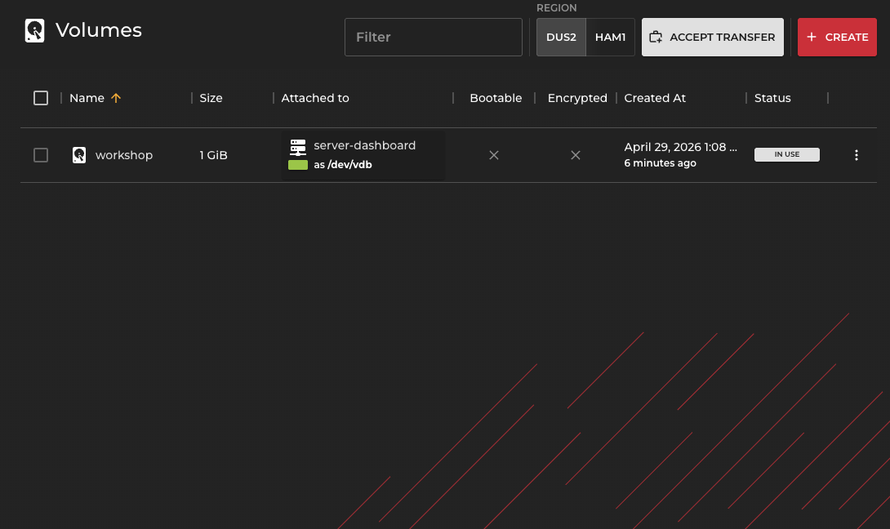

# Create and mount a volume with Horizon

## Overview

With this guide you can create a volume in SysEleven Dashboard and mount it to an instance.

## Goal

* Create a volume
* create a file system on the volume
* mount the volume on an instance

## Preparation

* You need your Openstack credentials
  * Username
  * Password
* Previously installed instance from task [02-instance-per-dashboard](/02-instance-per-dashboard)

---

## Start

* Log in at https://dashboard.syseleven.de Horizon Web UI with you credentials


---

### Create volume

* Under **Openstack** and **STORAGE** click on **VOLUMES**
* click the button **CREATE**



* Under **Volume Name** enter `workshop`
* Optionally add a **Description**
* Make sure the **Volume Source** is selected as `EMPTY`
  * Take note of the different volume types
* Enter a **Size (GiB)** of `1`
* Click **CREATE VOLUME** in the bottom right



---

* the volume will now be created and appears in the list



---

#### What did you notice?

* the volume is in state "available", because it has been created
but is not yet attached to an instance.

---

### Attach a volume to an instance

To attach the newly created volume to an instance and to use it there, do:

* Navigate to the **SERVERES** section of **OpenStack - COMPUTE**
* Unfold the context menu on the instance `server-dashboard` or `server-cli`
* Select the `Attach Volume` option



* Select the `workshop` volume and click **ATTACH VOLUME**



---

#### What did you notice?

* Navigate to the list of volumes
  * The volume is displayed as state "in-use"
  * This means it is now attached to an instance
  * You can also see what instance it is attached to and as what device



---

### Mounting a volume in an instance

* Use the jumphost to SSH in to the instance the volume is attached to

`ssh ubuntu@<Instance-IP>`

* Check if the operating system of the instance has found volume as a new device
* Volumes are named in alpabetical order like `/dev/vd[a-z]` and this action is logged in the system log

```plain
dmesg

[  511.161272] virtio-pci 0000:00:07.0: enabling device (0000 -> 0003)
[  511.194305] virtio_blk virtio4: [vdb] 2097152 512-byte logical blocks (1.07 GB/1.00 GiB)
```

* Next to the partitions of the OS (`vda`) also the new volume is displayed (`vdb`)
* Check for filesystem or partitions

```plain
lsblk -o NAME,FSTYPE,LABEL,SIZE,MOUNTPOINT

NAME    FSTYPE   LABEL            SIZE MOUNTPOINT
[...]
vda                                50G 
├─vda1  ext4     cloudimg-rootfs 49.9G /
├─vda14                             4M 
└─vda15 vfat     UEFI             106M /boot/efi
vdb                                 1G
```

* To mount and use the volume you need to create a file system, for example ext4:

```bash
sudo mkfs.ext4 /dev/vdb
```

* Check again with `lsblk`

```plain
lsblk -o NAME,FSTYPE,LABEL,SIZE,MOUNTPOINT

NAME    FSTYPE   LABEL            SIZE MOUNTPOINT
[...]
vda                                50G 
├─vda1  ext4     cloudimg-rootfs 49.9G /
├─vda14                             4M 
└─vda15 vfat     UEFI             106M /boot/efi
vdb     ext4                        1G
```

* We want to mount the volume to directory /mnt

```bash
sudo mount -t auto -v /dev/vdb /mnt
```

* Check the mount, for example using `df`

```plain
df -h

Filesystem      Size  Used Avail Use% Mounted on
[...]
/dev/vdb        974M   24K  907M   1% /mnt
```

* We can now write data to it

`sudo touch /mnt/hello.txt`

---

* Optionally we can unmount it again:

```bash
sudo umount /mnt
```

### Result

* The volume can now store persistent data
  * To permanently use the volume use `fstab`
* Volumes can also be detached and reattached to other instances
