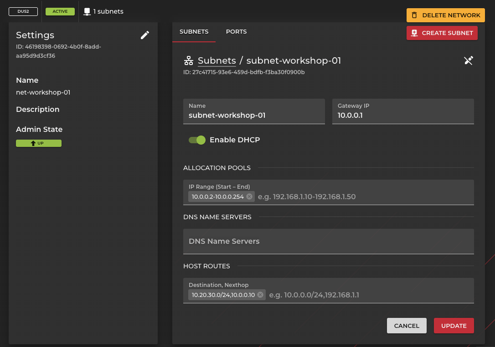

# Networking

## Overview

This examples aims at a less guided approach to create an openstack networking setup.

## Goal

* Create two servers in separate networks and interconnect them

## Preparation

* You need your credentials for Openstack

---

### Connection and Instructions

* Log in to https://dashboard.syseleven.de using your credentials
* For the first server and network we use the provided workshop instance and net
* Create a second network with a subnet using the IP range `10.20.30.0/24`
* Create a router and give it a port in the new network
  * Also give the new router a port in the old workshop network (you may need to manually enter a new IP address)
* Create an instance in the new network
  * Make sure it has the same security group as the workshop VM to allow connectivity
* Try to reach the new VM via ssh from your workshop VM - why is it not working
  
<details><summary>Fix the issue</summary>

#### First solution: Manual route via Linux tools

* Use `ip route` to set the correct route

```bash
sudo ip route add 10.20.30.0/24 via 10.0.0.10 # your gateway IP may vary
```

* Check the route in action

```bash
sudo ip route show
ssh $NEW_HOST
```

#### Second solution: The OpenStack way

We can set **host routes** for our subenets using openstack-cli or Dashboard.
They get announced to our hosts via DHCP.

* Use openstack-cli to announce the route for the old subnet ...

```bash
openstack subnet set --host-route destination=10.20.30.0/24,gateway=10.0.0.10
```

* ... or navigate to the workshop subnet and add a host-route in Dashboard



* you also need to renew the dhcp lease to get the info

```bash
networkctl list 
sudo networkctl renew ens3 # your interface name may vary
```

* Check the route in action

```bash
sudo ip route show
ssh $NEW_HOST
```

</details>

---

### Conclusion

* The new server did not need an additional routing rule because it only has it's default gateway
* Both private networks are now able to communicate with each other
