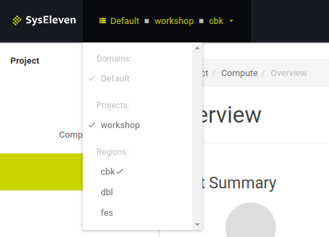
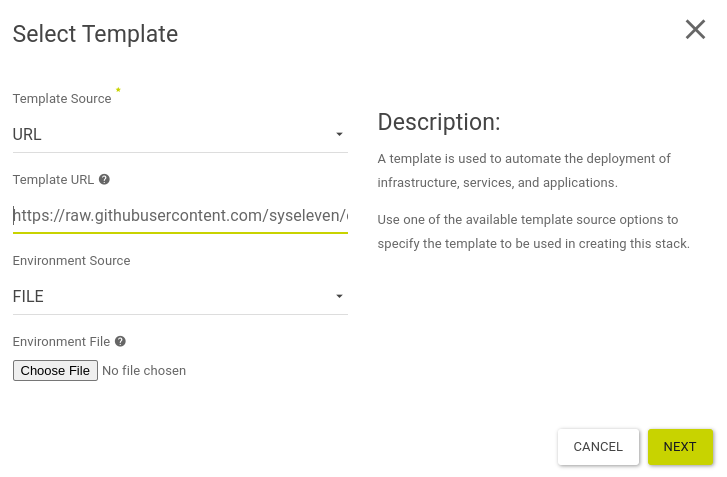
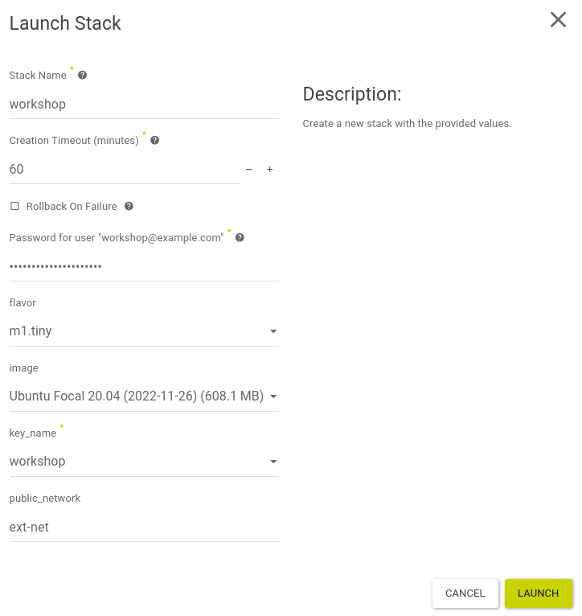

# First login in Openstack and jumphost

## Overview

With this guide you can create a single instance with a preinstalled Openstack client
via the Horizon Dashboard (GUI).

This jumphost contains all required tool to start with Openstack.

## Goal

* create a jumphost instance via Horizon (GUI)
* automated installation of Openstack client in the new instance

## Preparation

* You need your login credentials for Openstack
  * Username
  * Password
  * Project ID
  * Region name
* basic knowledge of using a Linux terminal and SSH

---

### Login

* Visit URL https://cloud.syseleven.de


* log in with your credentials
  * User Name: `<username>`
  * Password: `<password>`
* Click "Sign In"

### Choose region

* First check if you are in the correct region. If not please switch region.



### Start Heat Stack

* Click "Project" --> "Orchestration" --> "Stacks" to create the demo Stack in Horizon
* Click "Launch Stack"




* Select `URL` as **Template Source**
* Copy the URL of the demo Stack (1 long line!)

`https://raw.githubusercontent.com/syseleven/openstack-workshop-lab/main/01-erster-login-und-jumphost/kickstart.yaml`

* and paste it into the textfield **Template URL**
* choose `File` as **Environment Source**
* Click **NEXT**
---



* in the field **Stack Name** enter the name `workshop`
* enter your Openstack password into the field **Password for User ...**
* **flavor:** choose flavor `m1.tiny`
* **image:** select an arbitrary `Ubuntu Focal 20.04 (...)` image
* **key_name:** choose the existing SSH-key `workshop`
* Click "LAUNCH"

---

### Verify and connect

* Then the stack is in status **Create In Progress** or **Create Complete**
* Click **Compute** --> **Instances**
* notice the **Floating IP** in the column **IP Address** of your new instance
* open a terminal on your local machine and log in via SSH with username `syseleven` into your jumphost vm:

`ssh syseleven@<Workshop-Kickstart-FloatingIP> -A -i /path/to/private-key`

---

Maybe you need to confirm the following message with `yes`:

```
The authenticity of host 'x.x.x.x (x.x.x.x)' can't be established.
ED25519 key fingerprint is SHA256:xxxxxx/xxxxxx.
This key is not known by any other names
Are you sure you want to continue connecting (yes/no/[fingerprint])? yes
```

---

**Notice:**

provisioning of all required tools in the jumphost may take a few minutes

---

### Setting up and testing the Openstack client

* if you are successfully connected with the SysEleven-jumphost,
* copy the following content completely into your SSH terminal and execute it:

```
cat > /home/syseleven/myopenrc << EOL
export OS_AUTH_URL=https://keystone.cloud.syseleven.net:5000/v3
export OS_IDENTITY_API_VERSION=3
export OS_INTERFACE=public
export OS_ENDPOINT_TYPE=public
if [ -z "$OS_REGION_NAME" ]; then unset OS_REGION_NAME; fi
export OS_USER_DOMAIN_NAME="Default"
unset OS_TENANT_ID
unset OS_TENANT_NAME
read -p "Please enter your Openstack Project ID: " OS_PROJECT_ID
export OS_PROJECT_ID
read -p "Please enter your Openstack Region Name ('cbk', 'dbl', 'fes'): " OS_REGION_NAME
export OS_REGION_NAME
read -p "Please enter your Openstack Username: " OS_USERNAME
export OS_USERNAME
read -sp "Please enter your Openstack Password: " OS_PASSWORD
export OS_PASSWORD
EOL
```

* activate your environment for the Openstack client: 

`source /home/syseleven/myopenrc`

* Enter your individual credentials and confirm with **Enter**
  * `<Project ID>`
  * `<Region Name>`
  * `<Username>`
  * `<Password>`

Notice: find these settings (except the password) in Horizon under: 
**Project** --> **API Access** --> **VIEW CREDENTIALS**

---

### Using the Openstack clients

* Verify if the Openstack client works by this command:

`openstack server list`

Result: the newly created jumphost should appear
